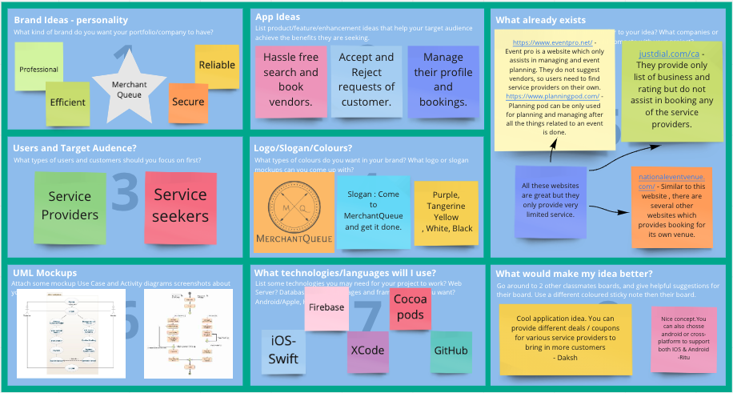

## MerchantQueue

## Brainstorm of my App for Mobile App Portfolio

## Author : Harshit Modi

## Date : September 24th, 2021

This is where all the planning and design for my future application in Mobile App Portfolio 1 can be found.

## Intro

The **MerchantQueue** is an iOS mobile application that allows users to interact with a variety of service providers. Any retail business owner, small, medium, or large, who provides any type of service, can register on this platform and increase their profits. This app will also provide them with digital identification, eliminating the need for them to develop their own mobile app. Customers can look for a service provider and make a reservation request. The service provider can next check his availability and accept or reject the request

## Version Control

I am going to be using a public repository in GitHub to track all of my changes and commits while I develop this app. I am currently in the **inception** phase. You can visit my _miro_ site that is running live [here](https://miro.com/app/board/o9J_lwDvtnc=/).

## Inception Phase

I am currently in the **inception** phase.

So far I have created a Github repository, brainstorm my app idea and get feedback from others on my **Miro** work board. With the help of **GenMyModel** I have created use-case diagram and activity diagram.

## UML Diagrams

## Use Case for MerchantQueue App

## Activity Diagram for MerchantQueue App

